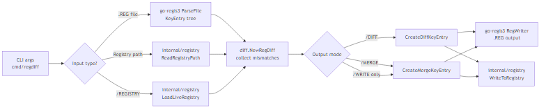

# go-regdiff Code Overview

This document gives developers a technical map of the go-regdiff codebase, how the pieces interact, and where to start when changing behavior. It is intentionally explanatory: if you're new to this repo, you should be able to read this top to bottom and understand how data moves through the system and which package to change for a given feature.

## Table of Contents

1. [Project Goals](#project-goals)
2. [High-Level Architecture](#high-level-architecture)
3. [Overview Diagram](#overview-diagram)
4. [Package Responsibilities](#package-responsibilities)
5. [Data Flow](#data-flow)
6. [Registry Integration](#registry-integration)
7. [Key Behaviors and Conventions](#key-behaviors-and-conventions)
8. [Testing Notes](#testing-notes)

---

## Project Goals

go-regdiff is a Go rewrite of the original regdiff tool. It compares, diffs, merges, and optionally writes Windows Registry data using `.REG` files. It aims for feature parity with the C# version while keeping `.REG` processing cross-platform and restricting live registry access to Windows. In practical terms, this means:

- You can parse and diff `.REG` files on any OS.
- Live registry reads and writes are implemented only on Windows.
- The comparison engine is OS-neutral and operates purely on `KeyEntry` trees.

## High-Level Architecture

The CLI loads one or more inputs (file or live registry), builds `KeyEntry` trees, compares them, and then emits diff/merge outputs or writes changes back to the registry. Most code changes fall into one of these steps, so it helps to keep the pipeline in mind while you’re reading or modifying behavior.

```text
CLI args
  -> parse inputs into KeyEntry trees
  -> compare trees (diff.RegDiff)
  -> create output trees (diff or merge)
  -> export .REG files or write to registry
```

## Overview Diagram



## Package Responsibilities

- `cmd/regdiff`: CLI entry point, argument parsing, and orchestration. This is where flags are normalized (`/FLAG` and `-flag`), inputs are loaded, and output/writes are triggered.
- `diff/`: comparison engine and parameter substitution. If you are changing what “different” means or how diffs/merges are computed, start here.
- `internal/registry/`: Windows-only registry read/write implementation and non-Windows stubs. This keeps the build cross-platform while letting Windows users interact with the live registry.
- External: `github.com/gersonkurz/go-regis3` parses and writes `.REG` files and defines the `KeyEntry` and `ValueEntry` types. go-regdiff does not parse `.REG` itself; it relies on this library.

## Data Flow

1. Inputs are read as `KeyEntry` trees.
   - `.REG` files are parsed by go-regis3.
   - Registry paths are read via `internal/registry`.
2. `diff.NewRegDiff` traverses both trees and records mismatches. The mismatch list is the single source of truth for later diff/merge generation.
3. Output trees are created:
   - `CreateDiffKeyEntry()` for a minimal changeset.
   - `CreateMergeKeyEntry()` for a merged view.
4. Outputs are written:
   - To `.REG` files using go-regis3 writers.
   - To the live registry on Windows when `/WRITE` is used.

## Registry Integration

Windows-specific files are guarded by build tags so that non-Windows builds compile and clearly report “unsupported” rather than failing at runtime.

- `//go:build windows` for live registry operations.
- `//go:build !windows` for stubs that return `ErrNotSupported`.

Key functions:

- `registry.ReadRegistryPath`: reads a live hive path into a tree.
- `registry.LoadLiveRegistry`: loads only the paths referenced by a `.REG` file, which keeps `/REGISTRY` comparisons scoped.
- `registry.WriteToRegistry`: applies a tree to the live registry.

## Key Behaviors and Conventions

- Key and value names are treated case-insensitively, matching Windows behavior.
- `.REG` output supports Unicode (Windows Registry Editor Version 5.00) and legacy REGEDIT4.
- Parameter substitution replaces `$$VAR$$` values before comparison or writing.
- `/REGISTRY` compares a `.REG` file against only the keys present in the file.

## Testing Notes

Tests use Go’s `testing` package and live under `diff/` as `*_test.go`. If you are changing comparison rules, add or update tests here so regression behavior is locked in.

```
go test ./...
```

For focused runs:

```
go test -v -run TestDiff ./diff
```
